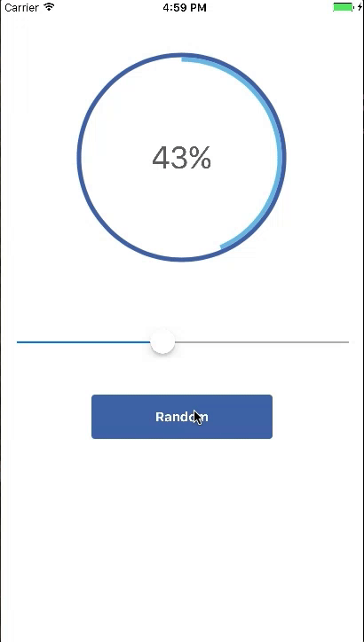
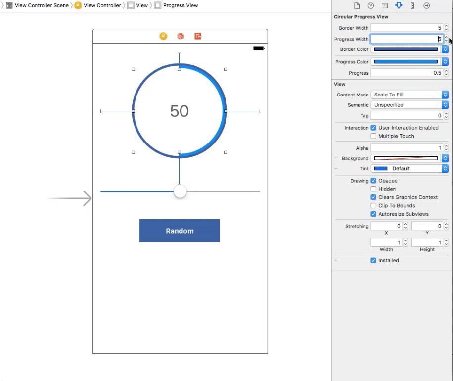

#ATCircularProgressView
<p align="center">
  
</p>

[](http://www.cocoapods.org/?q=atcircularprogressview)
[](https://github.com/Carthage/Carthage)


A super simple circular progress view for iOS that you can customize in Storyboard, or in code. It's lightweight and performant - uses CAShapeLayers to do drawing and CADisplayLink to update you on the progress.

##Usage

You can create an instance in code, or by dragging a UIView into your Storyboard and setting the subclass and module.

Here's how you set the progress
####Swift
```swift
progressView.setProgress(value: 0.5, animated: true, duration: 1, completion: nil)
```
####Objective-C
```objective-c
[self.progressView setProgressWithValue:0.5 animated:YES duration:1 completion:nil];
```

If you want to perform some work while the progress is changing, like update a label, set the `progressChanged` property

####Swift
```swift
 let progressChanged: (CircularProgressView, CGFloat) -> () = { [unowned self]
      (progressView, progress) in
      let value = Int(progress * 100.0)
      self.centralLabel.text = "\(value)%"
}
        
progressView.progressChanged = progressChanged
```

####Objective-C
```objective-c
   __weak typeof(self) weakSelf = self;
    self.progressView.progressChanged =  ^(CircularProgressView *progressView, CGFloat progress) {
        __strong typeof(self) self = weakSelf;
        self.label.text = [NSString stringWithFormat:@"%ld", (long)progress];
    };
```

`CircularProgressView` is designable in Storyboard. You can set width and color of the border/progress layers as well as the progress value.

<p align="center">
  
</p>

Check out the demo project and play around with it.

#Lame install

Just drag and drop CircularProgressView into your project

#Setup with CocoaPods

```
pod 'ATCircularProgressView'

use_frameworks!
```

#Setup with Carthage

```
git "atecle/ATCircularProgressView"
```

#Author
[@admtcl](https://twitter.com/admtcl)

#MIT License
    The MIT License (MIT)

    Copyright (c) 2016 Adam Tecle

    Permission is hereby granted, free of charge, to any person obtaining a copy of
    this software and associated documentation files (the "Software"), to deal in
    the Software without restriction, including without limitation the rights to
    use, copy, modify, merge, publish, distribute, sublicense, and/or sell copies of
    the Software, and to permit persons to whom the Software is furnished to do so,
    subject to the following conditions:

    The above copyright notice and this permission notice shall be included in all
    copies or substantial portions of the Software.

    THE SOFTWARE IS PROVIDED "AS IS", WITHOUT WARRANTY OF ANY KIND, EXPRESS OR
    IMPLIED, INCLUDING BUT NOT LIMITED TO THE WARRANTIES OF MERCHANTABILITY, FITNESS
    FOR A PARTICULAR PURPOSE AND NONINFRINGEMENT. IN NO EVENT SHALL THE AUTHORS OR
    COPYRIGHT HOLDERS BE LIABLE FOR ANY CLAIM, DAMAGES OR OTHER LIABILITY, WHETHER
    IN AN ACTION OF CONTRACT, TORT OR OTHERWISE, ARISING FROM, OUT OF OR IN
    CONNECTION WITH THE SOFTWARE OR THE USE OR OTHER DEALINGS IN THE SOFTWARE.
